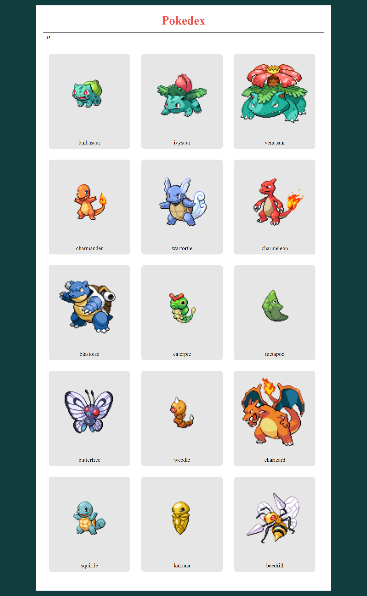

<h1> Pokedex </h1>

<h2> Projeto feito no curso da Danki Code, com foco no desenvolvimento das habilidades em utilização de APIs por meio do fetch. </h2>
<h2> Nesse projeto foi desenvolvido uma Pokedex, no qual você insere o número de pokémons desejado no input e então a API retorna o número determinado, sendo aleatório a aparição de cada pokémon</h2>

